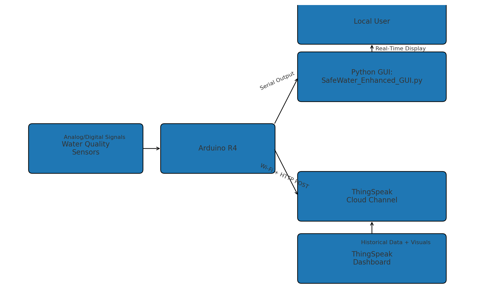
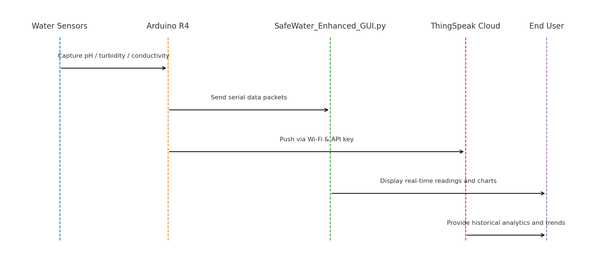

# SafeWater Monitor App


> Real-time water-quality monitoring from sensors to cloud: **Arduino R4 sensor acquisition**, **Python GUI visualization**, and **ThingSpeak telemetry** for environmental IoT prototypes.

---

## Summary

- **Edge (Arduino R4):** Reads water-quality sensors (pH, turbidity, conductivity) and optionally uploads to ThingSpeak.
- **Local UI (Python):** `SafeWater_Enhanced_GUI.py` displays real-time readings and charts.
- **Cloud (ThingSpeak):** Stores, visualizes, and enables alerts for historical trends.

---

## Repository Contents

```
├─ GUI_Components/
│  └─ SafeWater_Enhanced_GUI.py       # Main Python GUI entry point
├─ R4_Sensor_Only_ThingSpeak.ino      # Arduino sketch for sensor + ThingSpeak
├─ requirements.txt                   # Python dependencies
├─ SafeWater_Monitor_Final_Report.pdf # Background/report
└─ LICENSE
```

---

## Quick Start

### 1) Create environment

```bash
# Option A: conda
conda create -n safewater python=3.10 -y
conda activate safewater

# Option B: venv
python -m venv .venv
# Windows: .venv\Scripts\activate
# macOS/Linux:
source .venv/bin/activate
```

### 2) Install dependencies

```bash
pip install --upgrade pip
pip install -r requirements.txt
```

### 3) Flash Arduino R4

1. Open `R4_Sensor_Only_ThingSpeak.ino` in Arduino IDE.
2. Set Wi-Fi credentials and ThingSpeak API keys in the sketch.
3. Select board/port and **Upload**.

### 4) Launch the GUI

```bash
python GUI_Components/SafeWater_Enhanced_GUI.py
```

---

## System Diagram



---

## Data Flow



---

## Configuration

- **ThingSpeak:** Create a channel, enable fields, and map field indices in the Arduino sketch.
- **Serial settings:** Ensure baud rate/port matches the sketch.
- **Calibration:** Update conversion constants based on sensor specs.

---

## Troubleshooting

- **No cloud data:** Check Wi-Fi credentials, API key, and ThingSpeak channel setup.
- **GUI not showing data:** Verify COM port/baud; switch to cloud-pull mode if supported.
- **Flatline readings:** Recheck wiring, calibration, and sensor warm-up.

---

## Roadmap

- Containerized GUI runtime.
- Pluggable sensor drivers + calibration UI.
- Data export (CSV/Parquet) + WebSocket streaming.
- Local/cloud alerting on thresholds.
- CI checks and packaged releases.

---

## Contributing

1. Fork and create a feature branch.
2. Keep changes modular, documented, and tested.
3. Open a PR with clear description and test notes.

---

## License

This project is licensed under the **MIT License** — see [`LICENSE`](LICENSE).

---

## Team & Acknowledgments

**Stevens Institute of Technology — Class of 2025**

- **Melanie Dietrich** — Arduino/sensor software integration & Wi-Fi uploads (Computer Engineering '25)
- **Geraldine Dos Santos** — Hardware & sensor components (Mechanical Engineering '25)
- **Kaitlyn Jandrucko** — Hardware & sensor components (Mechanical Engineering '25)
- **Ester Ear** — Hardware & sensor components (Mechanical Engineering '25)
- **Moyosola Omole** — GUI development (Software Engineering '25)
- **Zahra Pournorouz, Ph.D.** — Advisor
- **Ali Farzbod, Ph.D.** — Sponsor

---
